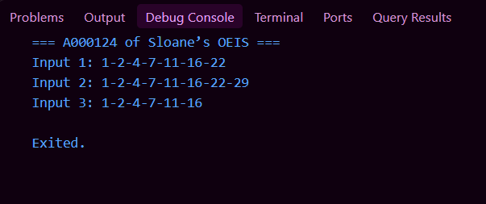
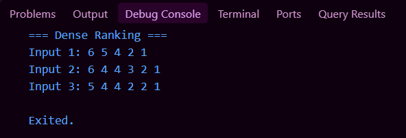
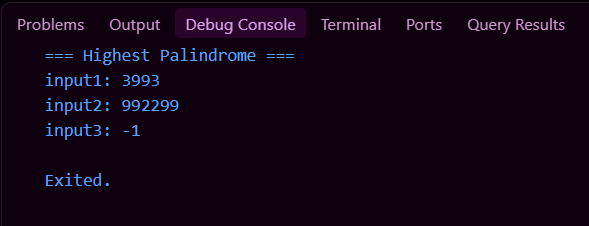

# Internship SE - Problem Solving Test

Repository ini berisi solusi dari 3 soal Problem Solving Test.

## Soal 1 - A000124 of Sloane’s OEIS
Buatlah sebuah program dengan output sebagai berikut. Input bisa dinamis yang menghasilkan output yang berbeda-beda sesuai input yang dimasukan. Gunakan rumus A000124 of Sloane’s OEIS.

Contoh: 
- Input: 7
- Output : 1-2-4-7-11-16-22

Soal: 
Buat fungsi untuk menyelesaikan rumus A000124 of Sloane’s OEIS!

File:
`soal_1.dart`

### Screenshot Output

---

## Soal 2 - Dense Ranking
GITS sedang bermain permainan arcade, dan dalam setiap permainan GITS ingin naik ke peringkat tertinggi dan juga ingin mengetahui setiap peringkat di setiap permainan. Dalam permainan ini menggunakan skema Dense Ranking​ dan memiliki aturan sebagai berikut:
- Peringkat pertama dapat diraih oleh pemain yang memiliki skor tertinggi
- Pemain yang memiliki skor yang sama memiliki peringkat yang sama.

Contoh:
- Empat pemain memiliki skor tertinggi sebagai berikut 100, 80, 80, dan 70, maka masing-masing pemain itu memiliki rangking 1, 2, 2, dan 3. 
- Jika GITS memiliki skor 60, 70, 100 setelah pertandingan maka rangking yang didapatkan adalah 4, 3, dan 1.

Sampel Input:
7
100 100 50 40 40 20 10 
4
5 25 50 120

Sampel Output:
6 4 2 1

Keterangan:
- 7​ adalah bentuk bilangan bulat, angka yang menunjukkan pada jumlah pemain yang ikut serta.
- 100 100 50 40 40 20 10 ​ adalah daftar skor yang diurutkan dari nilai terbesar ke nilai terkecil
(dalam bentuk array integer).
- 4 ​adalah jumlah permainan yang diikuti oleh GITS. 
- 5 25 50 120 ​adalah skor yang didapatkan oleh GITS.

Soal:
Buat fungsi yang digunakan untuk menyelesaikan permasalahan Dense Ranking!

File:
`soal_2.dart`

### Screenshot Output

---

## Soal 3 - Highest Palindrome
Diberikan sebuah string yang merepresentasikan sebuah angka, tujuan utamanya adalah untuk menemukan palindrom terbesar yang bisa dibentuk dengan mengubah maksimal 'k' digit dalam string tersebut. Palindrom adalah angka yang terbaca sama baik dari depan maupun dari belakang. Kamu diberikan sebuah string 's' yang merepresentasikan sebuah angka dan sebuah bilangan bulat 'k'. Tugas kamu adalah menemukan Highest Palindrome yang dapat dibentuk dengan mengubah paling banyak 'k' digit pada string 's'.

Sampel 1:
Input:
string: 3943 
k: 1 
palindrom:
1. 3943  => 3993
2. 3943 => 3443
Output: 3993
Penjelasan: Dari bentuk palindrom yang diperoleh maka highest palindrome-nya adalah 3993 dikarenakan 3993 > 3443.

Sampel 2:
Input:
string: 932239 
k: 2
palindrom:
1. 932239  => sudah palindrome
2. Perlu replacement sebanyak k = 2 untuk mendapatkan nilai tertinggi => 992299
Output: 992299
Penjelasan: Dari bentuk palindrom yang diperoleh maka highest palindrome-nya adalah 992299 dikarenakan 992299 > 932239.

Aturan:
1. Jika dari sebuah string tidak ditemukan bentuk palindrome-nya meski sudah melakukan replacement dan tidak merepresentasikan sebuah angka maka akan mengeluarkan output -1.
2. Tidak boleh menggunakan fungsi bawaan/tools untuk pencarian/filter/sort.
3. Tidak boleh menggunakan looping.
4. Hanya diperkenankan menggunakan rekursif.

Soal:
Buat fungsi yang digunakan untuk menyelesaikan permasalahan Highest Palindrome!

File:
`soal_3.dart`

### Screenshot Output

